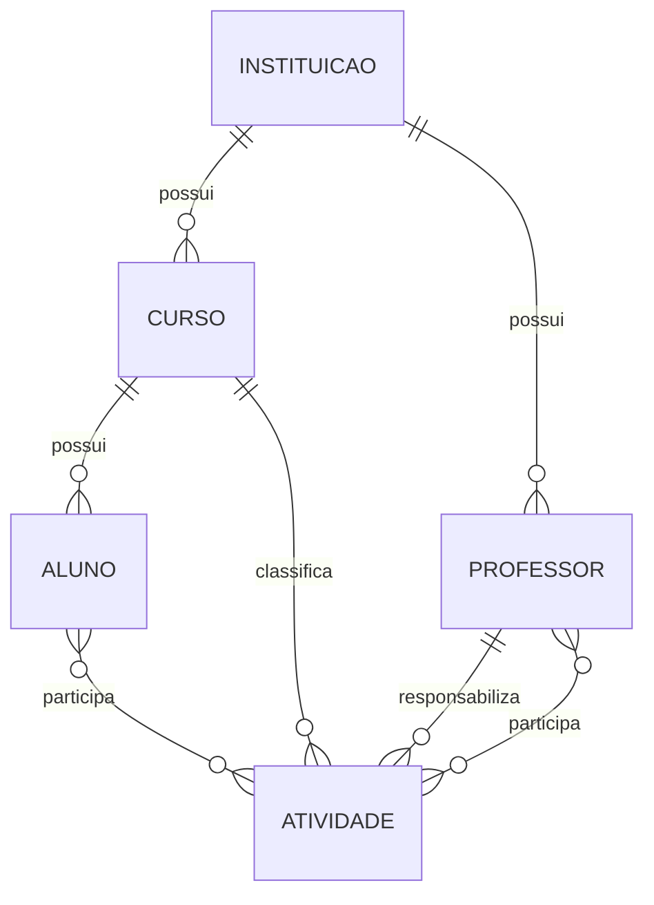

# Modelo de dados — inscrições da SNCTZO 2026

## 1. Princípios

- O termo oficial do domínio é **atividade**.
- Cada atividade pertence a um curso principal.
- A instituição da atividade é obtida por meio do curso; a atividade não armazena `instituicao_id`.
- Cada atividade possui exatamente um professor responsável.
- Cada atividade possui pelo menos um participante, aluno ou professor.
- Alunos e professores podem participar de várias atividades.
- O professor responsável só participa da atividade quando for incluído explicitamente na lista de participantes.
- O modelo não possui a entidade `evento` no MVP.
- Registros existentes não são alterados pelo formulário público.

## 2. Diagrama de relacionamentos



A exigência de pelo menos um participante considera a união de alunos e professores. Essa regra será validada pela aplicação porque não cabe em uma constraint simples entre as duas tabelas associativas.

## 3. Tabelas

### `instituicoes`

| Coluna | Tipo | Nulável | Regra |
|---|---|---:|---|
| `id` | `BIGINT UNSIGNED` | não | chave primária |
| `nome` | `VARCHAR(150)` | não | único, sem diferenciar maiúsculas ou acentos |
| `instagram` | `VARCHAR(255)` | sim | URL ou perfil textual |
| `facebook` | `VARCHAR(255)` | sim | URL ou perfil textual |
| `site` | `VARCHAR(2048)` | sim | URL normalizada |
| `outros_links` | `TEXT` | sim | texto livre em uma única coluna |
| `created_at` | `DATETIME` | não | gerenciado pelo Laravel |
| `updated_at` | `DATETIME` | não | gerenciado pelo Laravel |

Regras:

- FCBS e FCEE são instituições independentes.
- Novas instituições ficam disponíveis em inscrições futuras.
- O formulário público só cria instituições; ele não altera instituições existentes.

### `cursos`

| Coluna | Tipo | Nulável | Regra |
|---|---|---:|---|
| `id` | `BIGINT UNSIGNED` | não | chave primária |
| `instituicao_id` | `BIGINT UNSIGNED` | não | chave estrangeira para `instituicoes.id` |
| `nome` | `VARCHAR(150)` | não | único dentro da instituição |
| `created_at` | `DATETIME` | não | gerenciado pelo Laravel |
| `updated_at` | `DATETIME` | não | gerenciado pelo Laravel |

Constraint composta:

```text
UNIQUE (instituicao_id, nome)
```

A comparação do nome ignora maiúsculas e acentos. O mesmo nome pode existir em instituições diferentes.

### `professores`

| Coluna | Tipo | Nulável | Regra |
|---|---|---:|---|
| `id` | `BIGINT UNSIGNED` | não | chave primária |
| `instituicao_id` | `BIGINT UNSIGNED` | não | chave estrangeira para `instituicoes.id` |
| `nome` | `VARCHAR(150)` | não | nome completo |
| `email` | `VARCHAR(254)` | não | único e armazenado em minúsculas |
| `created_at` | `DATETIME` | não | gerenciado pelo Laravel |
| `updated_at` | `DATETIME` | não | gerenciado pelo Laravel |

O e-mail possui constraint `UNIQUE`, mas não é a chave primária. A busca pública de professores será exata por e-mail.

### `alunos`

| Coluna | Tipo | Nulável | Regra |
|---|---|---:|---|
| `id` | `BIGINT UNSIGNED` | não | chave primária |
| `curso_id` | `BIGINT UNSIGNED` | não | chave estrangeira para `cursos.id` |
| `nome` | `VARCHAR(150)` | não | nome completo |
| `created_at` | `DATETIME` | não | gerenciado pelo Laravel |
| `updated_at` | `DATETIME` | não | gerenciado pelo Laravel |

O aluno não possui matrícula nem outra chave forte. Não haverá constraint global de unicidade para nome e curso, pois pessoas diferentes podem compartilhar esses dados. A aplicação aceita o risco de registros duplicados entre inscrições.

### `atividades`

| Coluna | Tipo | Nulável | Regra |
|---|---|---:|---|
| `id` | `BIGINT UNSIGNED` | não | chave primária |
| `token_submissao` | `CHAR(36)` | não | UUID único para idempotência |
| `curso_id` | `BIGINT UNSIGNED` | não | chave estrangeira para o curso principal |
| `professor_responsavel_id` | `BIGINT UNSIGNED` | não | chave estrangeira para `professores.id` |
| `nome` | `VARCHAR(255)` | não | nome da atividade |
| `participa_dia_20` | `BOOLEAN` | não | participação em 20/10/2026 |
| `participa_dia_21` | `BOOLEAN` | não | participação em 21/10/2026 |
| `resumo` | `TEXT` | não | máximo de 5.000 caracteres na aplicação |
| `observacoes` | `TEXT` | sim | máximo de 5.000 caracteres na aplicação |
| `termos_aceitos_em` | `DATETIME` | não | instante da submissão aceita |
| `versao_termos` | `VARCHAR(32)` | não | versão dos textos aceitos |
| `email_confirmacao_enviado_em` | `DATETIME` | sim | preenchido após envio bem-sucedido |
| `created_at` | `DATETIME` | não | gerenciado pelo Laravel |
| `updated_at` | `DATETIME` | não | gerenciado pelo Laravel |

Constraints:

```text
UNIQUE (token_submissao)
CHECK (participa_dia_20 = TRUE OR participa_dia_21 = TRUE)
```

A aplicação garante que o professor responsável pertença à instituição do curso principal.

### `atividade_aluno`

| Coluna | Tipo | Nulável | Regra |
|---|---|---:|---|
| `atividade_id` | `BIGINT UNSIGNED` | não | chave estrangeira para `atividades.id` |
| `aluno_id` | `BIGINT UNSIGNED` | não | chave estrangeira para `alunos.id` |

Constraint:

```text
UNIQUE (atividade_id, aluno_id)
```

### `atividade_professor`

| Coluna | Tipo | Nulável | Regra |
|---|---|---:|---|
| `atividade_id` | `BIGINT UNSIGNED` | não | chave estrangeira para `atividades.id` |
| `professor_id` | `BIGINT UNSIGNED` | não | chave estrangeira para `professores.id` |

Constraint:

```text
UNIQUE (atividade_id, professor_id)
```

O relacionamento de participação é independente de `professor_responsavel_id`. Assim, o responsável pode ou não constar como participante.

## 4. Integridade referencial

- Exclusões de instituição, curso, professor ou aluno referenciado devem ser bloqueadas.
- A exclusão futura de uma atividade poderá remover em cascata apenas seus registros nas tabelas associativas.
- Todas as chaves estrangeiras terão índices.
- A aplicação removerá espaços externos e reduzirá espaços repetidos antes de comparar nomes.
- Instituições e cursos usarão collation case-insensitive e accent-insensitive.
- E-mails serão removidos de espaços, convertidos para minúsculas e validados antes da persistência.

## 5. Resolução de registros

### Instituição e curso

- Comparar nomes sem diferenciar maiúsculas ou acentos.
- Reutilizar o registro existente quando houver correspondência.
- Criar o registro somente quando não houver correspondência.
- Nunca atualizar um registro existente a partir do formulário público.

### Professor

- Pesquisar por correspondência exata do e-mail normalizado.
- Quando encontrado, preencher e bloquear nome e instituição.
- Quando ausente, criar o professor com nome, e-mail e instituição.
- Quando um e-mail existente for informado com dados incompatíveis, rejeitar a submissão com erro de validação.

### Aluno

- Permitir a seleção de aluno pré-carregado da instituição.
- Criar um registro quando o usuário optar por um aluno novo.
- Não tentar deduplicação global automática por nome e curso.

## 6. Regras de participação

- A atividade deve possuir pelo menos um registro em `atividade_aluno` ou `atividade_professor`.
- Alunos participantes devem pertencer à instituição do curso principal.
- Professores participantes podem pertencer a outras instituições.
- O mesmo aluno ou professor não pode aparecer duas vezes na mesma atividade.
- Para registros novos na mesma submissão, bloquear professores com e-mail repetido e alunos com a mesma combinação normalizada de nome e curso.

## 7. Transação de inscrição

A submissão final será atômica:

1. Validar os dados, os termos, o prazo e o token.
2. Resolver ou criar a instituição e os cursos.
3. Resolver ou criar o professor responsável.
4. Resolver ou criar os participantes.
5. Criar a atividade.
6. Criar os relacionamentos de participação.
7. Confirmar a transação.

Uma falha em qualquer etapa anterior à confirmação desfaz todas as alterações. O e-mail será enviado somente depois da confirmação e não participará da transação.

## 8. Dados deliberadamente não modelados

- Cada checkbox de aceite: substituído por `termos_aceitos_em` e `versao_termos`.
- Evento ou edição: os valores da SNCTZO 2026 ficam na configuração da aplicação.
- Cadastrante: o professor responsável assume esse papel.
- Matrícula de aluno: não será solicitada.
- Status administrativo da atividade: depende do futuro backoffice.
- Rascunho: os dados só serão persistidos na submissão final.
